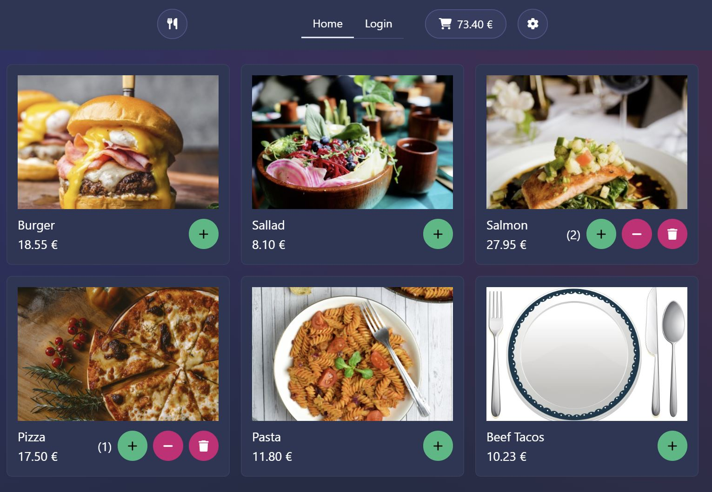

# Restaurant app

This app is a test project to try out Svelte ja SvelteKit. The app features a simple design for a restaurant's online website. For example, user can:

- Browse menu
- Add and remove food items to cart
- View and purchase the cart
- Login as Admin to edit/add/delete food items in the menu

## Example images

A screenshot of the menu page when a user has added few items to their cart.

## Image attributes

<a href="https://www.freepik.com/free-vector/dining-set_6027751.htm#query=cutlery%20cartoon&position=49&from_view=keyword&track=ais">Image by brgfx</a> on Freepik
